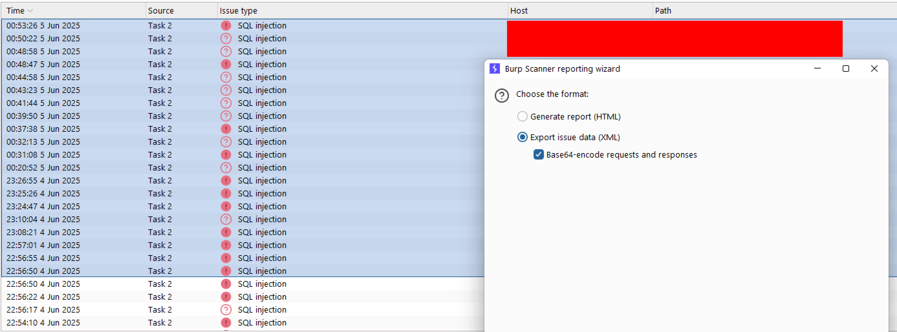

# BurpToAff
BurpToAff (Burp to Affected) a simple tool to convert reports from Burp Suite into affected URLs. The tool supports GET and POST methods, useful for penetration testers and security researchers who want to distill scan data into a more concise format, often used in pentesting reports.

```
burptoaff -h
usage: burptoaff [-h] input output

Convert BurpSuite XML to simplified request list.

positional arguments:
  input       Input XML file exported from BurpSuite
  output      Output text file to save normalized requests

options:
  -h, --help  show this help message and exit
```


## Sample 
```
burptoaff xss.xml affectedxss.txt
✅ Normalized output saved to affectedxss.txt
```
```
cat affectedxss.txt
[GET] https://redacted/endpoint/xxx/?endpoint=value'%3e%3cscript%3ealert(1)%3c%2fscript%3exuy5j 
[POST] https://redacted/endpoint/xxx/ (param=value&vulnparam='%3e%3cscript%3ealert(1)%3c%2fscript%3exuy5j )
```

## Use Case
1. [Create Report in xml](https://portswigger.net/burp/documentation/desktop/running-scans/reporting/report-settings) 
Imagine you have hundreds of vulnerable GET/POST endpoints with different insertpoints, and they were included in the pentest report as neat impacts but had to be copied one by one, leave that! Just export the XML.

2. Then run this tools


## Contribution
We support open contributions to support all types of post data, not relying on one type.